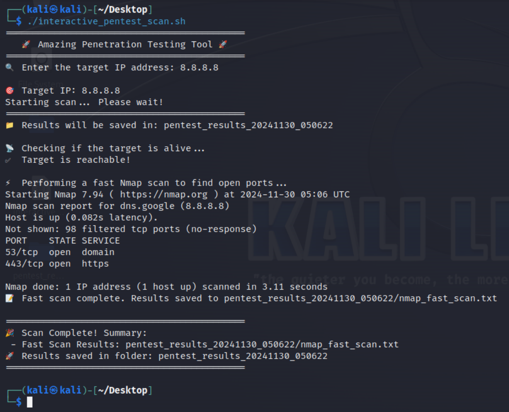

# HW - 02

## Penetration Testing using Bash script

Bash Script:

\#!/bin/bash

echo "============================================"

echo " 🚀 Amazing Penetration Testing Tool 🚀 "

echo "============================================"

\# Prompt for the target IP address

read -p "🔍 Enter the target IP address: " TARGET

\# Check if an IP address was entered

if \[ -z "$TARGET" ]; then

echo "❌ Error: No IP address provided. Exiting."

exit 1

fi

echo ""

echo "🎯 Target IP: $TARGET"

echo "Starting scan... Please wait!"

echo "============================================"

\# Create a results directory to organize outputs

RESULTS\_DIR="pentest\_results\_$(date +%Y%m%d\_%H%M%S)"

mkdir $RESULTS\_DIR

echo "📁 Results will be saved in: $RESULTS\_DIR"

\# Step 1: Ping the Target

echo ""

echo "📡 Checking if the target is alive..."

if ping -c 1 -W 1 $TARGET &> /dev/null; then

echo "✅ Target is reachable!"

else

echo "⚠️ Target seems unreachable! Proceeding anyway..."

fi

\# Step 2: Fast Nmap Scan

echo ""

echo "⚡ Performing a fast Nmap scan to find open ports..."

nmap -F $TARGET -oN $RESULTS\_DIR/nmap\_fast\_scan.txt

echo "📝 Fast scan complete. Results saved to $RESULTS\_DIR/nmap\_fast\_scan.txt"

\# Step 3: Summary

echo ""

echo "============================================"

echo "🎉 Scan Complete! Summary:"

echo " - Fast Scan Results: $RESULTS\_DIR/nmap\_fast\_scan.txt"

echo "🚀 Results saved in folder: $RESULTS\_DIR"

echo "============================================"


<figure><figcaption></figcaption></figure>

#### **Script Explanation (Short)**

This script automates basic penetration testing tasks, making it beginner-friendly and organized:

1. **Interactive Input**:
   * Asks for the target IP to avoid mistakes and ensure clarity.
2. **Ping Check**:
   * Confirms if the target is reachable before running scans.
3. **Fast Nmap Scan**:
   * Quickly detects open ports on the target.
4. **Organized Output**:
   * Saves results in a timestamped folder for easy access.
5. **Visual Feedback**:
   * Uses icons and clear messages for an engaging experience.

#### **Generated Files**:

* `nmap_fast_scan.txt`: List of open ports.

This script is simple, engaging, and essential for beginners to learn reconnaissance basics!

#### **How to Run the Script**

1. Save it as _`amazing_pentest_tool.sh`_.
2. Make it executable:

```
chmod +x amazing_pentest_tool.sh
```

3. Run it in your terminal:

```
./amazing_pentest_tool.sh
```

4. Enter the target IP address when prompted.

